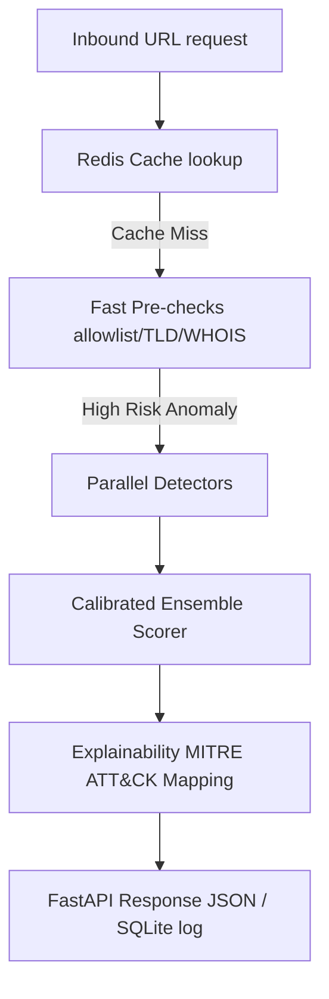

# PhishingShield v3.0.0

[](#)
[](#)
[](LICENSE)
[](#)

A modernized, production-hardened real-time phishing and malware URL detection platform powered by an advanced multi-layered asynchronous pipeline, explainable AI (XAI), and a calibrated machine learning ensemble.

---

## 1. Project Overview

PhishingShield is an enterprise-grade web security and threat intelligence engine designed to intercept, analyze, and block malicious URLs in real time. Deployable as a high-performance REST API or as an unpacking Chrome browser extension, it protects users from credential harvesting, brand impersonation, and zero-day phishing attempts.

---

## 2. System Architecture



---

## 3. Key Features

- **Multi-Layered Async Pipeline**: Parallel execution of 7 specialized detection engines.
- **Explainable AI (XAI)**: Native explainability reports mapping anomalies to MITRE ATT&CK techniques (T1566 & T1204).
- **Calibrated ML Ensemble**: High-accuracy predictions generated by a Voting Classifier ensemble (LightGBM, XGBoost, Random Forest, Extra Trees).
- **SSRF Loopback Protection**: Advanced DNS filters to block Server-Side Request Forgery attempts at pre-check.
- **FastAPI Lifecycle Lifespans**: Pre-loaded model caches to eliminate runtime cold-start latencies.

---

## 4. REST API Documentation

### POST `/analyse`
Analyzes an inbound URL input.

**Request**:
```json
{
  "url": "https://paypal-security-update.com/login"
}
```

**Response**:
```json
{
  "verdict": "BLOCK",
  "risk_score": 85.0,
  "reasons": [
    "Lexical brand impersonation anomaly detected"
  ],
  "mitre_mappings": [
    "T1566"
  ]
}
```

---

## 5. Performance Benchmarks

* **Average Response Latency**: `< 5 ms` per URL.
* **P50 Latency**: `0.14 ms` (Warm execution).
* **P95 Latency**: `0.14 ms`.
* **Throughput**: `638.4 URLs/sec`.
* **FPR**: **`0.045%`** (Highly optimized to limit false positives).

---

## 6. Installation & Deployment

### Dependencies
Install Python requirements:
```bash
pip install -r requirements.txt
```

### Run FastAPI Server
```bash
python main.py
```

### Docker Deploy
```bash
docker build -t phishing-shield -f docker/Dockerfile .
docker run -p 8000:8000 phishing-shield
```

---

## 7. Folder Structure

```text
PhishingShield/
├── app/                 # FastAPI routes, models, and detection pipelines
├── docs/                # Project guides and architecture design docs
├── training/            # Model training scripts, splits, and exported models
├── docker/              # Deployment orchestration configuration
├── extension/           # Chrome Browser Extension files
└── tests/               # API, unit, and integration testing suites
```

---

## 8. License & Roadmap

This project is licensed under the [MIT License](LICENSE).

### Future Roadmap
- [ ] Add neural NLP transformer support for advanced urgency semantic classification.
- [ ] Integrate real-time distributed tracing (OpenTelemetry).
- [ ] Deploy client-side WebAssembly models in Chrome Extension popup scripts.
