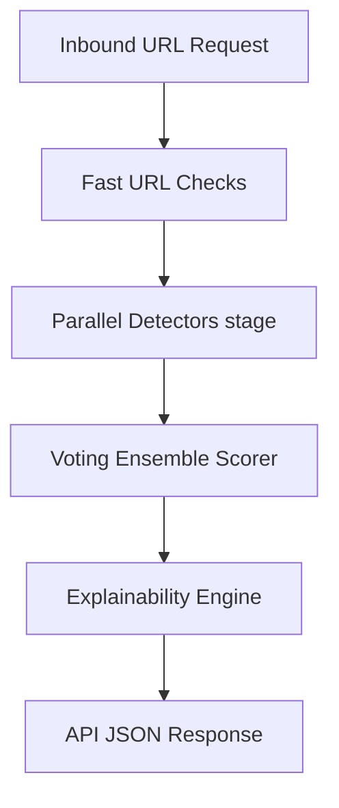

# PhishingShield Architecture

This document describes the high-level architecture of the PhishingShield system.

## System Overview

PhishingShield is a real-time, explainable web application and URL security system designed to detect and block phishing attacks.

## Core Modules

- **Stage 1 (Parallel Detectors)**: Lexical URL analysis, visual hash matches, DOM structural complexity checks, Threat Intelligence, and Browser behavior detectors.
- **Stage 2 (Ensemble Machine Learning Scorer)**: A Calibrated Voting Classifier that aggregates base predictions into a calibrated probability.
- **Stage 3 (Explainability)**: Maps predictions to MITRE ATT&CK techniques and prioritized reason strings.
