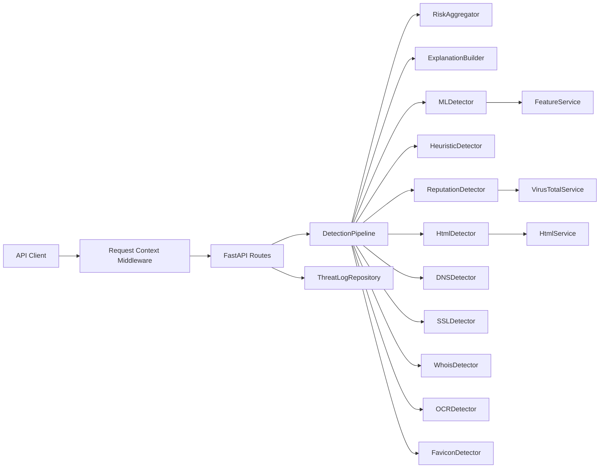
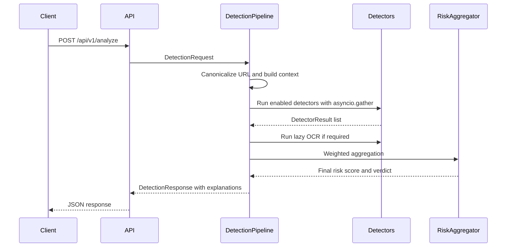

# Classifier Modernization Architecture

## Overview

The project now supports a modular production architecture while preserving the original FastAPI endpoints. The legacy `/check`, `/logs`, `/feedback`, `/health`, and `/metrics` routes remain available. The new versioned pipeline is exposed at `/api/v1/analyze` with detector-level evidence and weighted risk aggregation.

## Component Diagram

## Detection Sequence

## Production Features

- Modular `app/` package with `api`, `config`, `detectors`, `pipeline`, `services`, `schemas`, `database`, and `models`.
- Detector plugin contract: `analyze()`, `explain()`, and `health_check()`.
- Parallel detector execution with failure isolation.
- Weighted risk aggregation with configurable detector weights.
- Explainable AI response reasons from detector evidence.
- URL canonicalization, punycode conversion, percent-decoding, homograph skeletons, SSRF private-host guard, and dynamic trusted-domain reload.
- Model integrity verification hook for SHA256 and version metadata.
- JSON logging formatter, Prometheus text metrics endpoint, health/readiness/liveness endpoints, request IDs, and correlation IDs.
- Optional threat-intelligence adapter classes for Google Safe Browsing, OpenPhish, PhishTank, URLHaus, AbuseIPDB, and Cloudflare Radar.

